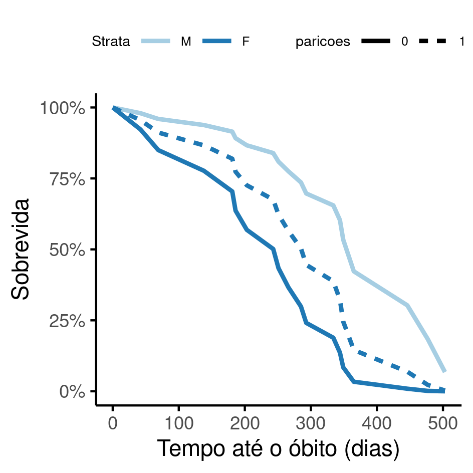

```{r setup, include=FALSE}
knitr::opts_chunk$set(echo = FALSE)
knitr::opts_knit$set(root.dir = normalizePath(".."))
options(scipen = 999)
library(pander)
library(knitr)
library(philsfmisc)
panderOptions('table.style', 'rmarkdown')
panderOptions('table.split.table', 160)
```

---

**Prognóstico de sobrevida em cativeiro de Tityus bahiensis capturados em Americana/SP**

**Histórico do documento**

```{r history}
Version <- c("01")
Changes <- c("Versão inicial")
history <- cbind(Version, Changes)
colnames(history) <- c("Versão", "Alterações")
# pander(history, split.cells = 70)
kable(history)
```

---

# Lista de abreviaturas

- DP: Desvio padrão
- IC: Intervalo de confiança
- SMS: Secretaria Municipal de Saúde

# Contexto

## Objetivos

Determinar o tempo de sobrevida em cativeiro de espécimes capturados pelo programa de Vigilância Epidemiológica da SMS de Americana/SP.

## Recepção e tratamento dos dados

Dados recebidos com data de entrada e de óbito de espécimes de escorpião *Tityus bahiensis* capturados pelo programa de vigilância da secretaria Municipal de Saúde de Americana/SP.

Todos os espécimes foram mantidos em cativeiro até o óbito, portanto nenhuma observação foi censurada.
O tempo de sobrevida, em dias, foi calculado a partir das datas com acurácia de calendário isto é, levando em conta anos bissextos.

Duas fêmeas tiveram número de parições maior que zero registrado.
O número de parições de todos os outros espécimes foi definido como zero, de modo que esta contagem pudesse ser usada como covariável no prognóstico.

# Metodologia

```{r results, include=FALSE}
source("scripts/results.R", encoding = 'UTF-8')
```

## Variáveis

### Desfechos primário e secundário

O desfecho primário foi definido como o tempo, em dias, até o óbito.

### Covariáveis

O sexo e o número de parições foram usados como covariáveis na estimativa do tempo até o óbito.
O tempo até o óbito de metade da amostra (meia-vida na amostra) foi estimado separadamente para machos e fêmeas, e ajustado pelo número de parições das fêmeas.

## Análises Estatísticas

O perfil dos espécimes do estudo foi descrito na baseline.
O sexo e o número de parições foram descritas como
média (DP)
ou frequência e proporção (%), conforme apropriado.
As distribuições das características dos espécimes foram resumidas em tabelas e visualizadas em gráficos exploratórios.

A análise de sobrevida foi realizada com o modelo de regressão de sobrevida semi-paramétrico de Cox.
Este modelo é capaz de estimar o tempo até o óbito, ajustando o tempo pelo sexo e número de parições.

O modelo de Cox presume que os riscos de óbito entre machos e fêmeas são proporcionais.
Este requisito foi avaliado por inspeção visual das curvas de sobrevida -- como as curvas não se cruzam, o modelo de Cox foi usado conforme a especificação descrita no plano analítico e não houve necessidade de usar um modelo não paramétrico (estimação de Kaplan-Meier).

Os tempos de sobrevida (em dias) da meia-vida de machos e fêmeas foram extraídos do modelo final, e apresentados com seus respectivos intervalos de confiança.

Todas as análises foram realizadas ao nível de significância de 5%.
Todos os testes de hipóteses e intervalos de confiança calculados foram
bicaudais.

Esta análise foi realizada utilizando-se o software `R` versão `r getRversion()`.

# Resultados

## População do estudo e acompanhamento

```{r desc_datas,}
datas <- range(data.raw$entrada_d)
tempos <- analytical %>% select(tempo) %>% range()
tempos_m <- analytical %>% filter(sexo == "M") %>%  pull(tempo) %>% range()
tempos_f <- analytical %>% filter(sexo == "F") %>%  pull(tempo) %>% range()
tempo_m_m <- analytical %>% filter(sexo == "M") %>%  pull(tempo) %>% median()
tempo_m_f <- analytical %>% filter(sexo == "F") %>%  pull(tempo) %>% median()
```

Um total de `r nrow(analytical)` espécimes foram recebidos pelo programa de Vigilância Epidemiológica da SMS de Americana/SP entre `r datas[1]` e `r datas[2]` (Tabela 1).
Destes 6 (`r format.pct(6/18, 0)`) eram machos e 12 (`r format.pct(12/18, 0)`) fêmeas.
Duas fêmeas produziram prole no cativeiro, e uma delas o fez duas vezes.

```{r tab_desc}
tab_desc %>%
    as_kable(
    align = "lccc",
    caption = "**Tabela 1** Caracerísticas dos espécimes de T. bahiensis recebidos pelo Programa de Vigilância Epidemiológica de Americana/SP."
  )
```

Os tempos de sobrevida em cativeiro dos escorpiões recebidos variou entre `r tempos[1]` e `r tempos[2]` dias.
Os tempos de sobrevida dos espécimes machos variaram entre `r tempos_m[1]` e `r tempos_m[2]` dias e das fêmeas `r tempos_f[1]` e `r tempos_f[2]` dias.
O tempo de sobrevida mediano dos machos foi `r tempo_m_m` e das fêmeas `r tempo_m_f` dias (Figura 1).

```{r fig1, fig.cap="**Figura 1** Distribuição dos tempos de sobrevida na população do estudo."}
# 
knitr::include_graphics("../figures/tempo.png", error = FALSE)
```

## Prognóstico dos espécimes em cativeiro

```{r}
# coxph(formula = Surv(tempo, obito) ~ 1, data = analytical) %>% survfit()
      # n events median 0.95LCL 0.95UCL
# [1,] 18     18    285     203     365
```

O tempo de meia-vida em cativeiro dos escorpiões recebidos foi 285 (IC: 203 até 365) dias.
O tempo de meia-vida dos machos foi `r s[1,1]` dias
<!-- (IC: `r format.interval(s[1, 2:3], 0)` dias) -->
e das fêmeas `r s[2,1]` dias
<!-- (IC: `r format.interval(s[2, 2:3], 0)` dias) -->
(Tabela 2).

```{r tab_inf}
tab_inf %>%
    as_kable(
    align = "lccc",
    caption = "**Tabela 2** Prognóstico do tempo de meia-vida de T. bahiensis em cativeiro.\n Números em parênteses indicam Intervalos de 95% Confiança."
  )
```

A figura 1 mostra as curvas de sobrevida de machos, fêmeas com 0 parições e fêmeas com uma parição.
De acordo com o modelo ajustado, fêmeas que tiveram uma parição podem ter um prognóstico mais favorável em cativeiro, com um acréscimo de sobrevida estimado em torno de 40 dias (`r s[3, 1]` dias, IC: `r format.interval(s[3, 2:3], 0)`).

```{r fig2, fig.cap="**Figura 2** Sobrevida em cativeiro dos espécimes recebidos pelo Programa de Vigilância Epidemiológica de Americana/SP."}
# 
knitr::include_graphics("../figures/sobrevida.png", error = FALSE)
```

<!-- As fêmeas exibiram risco três vezes maior que os machos com HR `r inline_text(tab_sexo, variable = sexo, level = "F", digits = 1)`. -->
<!-- Corrigindo pelas parições observadas o risco é quatro vezes maior, com HR ajustada `r inline_text(tab_sexo.par, variable = sexo, level = "F", digits = 1)`. -->

```{r tab_mod}
# tab_mod %>%
#     as_kable(
#     align = "lccc",
#     caption = "**Tabela 2** caption"
#   )
```

# Observações e limitações

Embora o número de parições tenha contribuído para um melhor ajuste do tempo de sobrevida, a amostra de estudo era pequena e o termo de interação planejado (**SAP-2021-008-JB-v01**) entre o sexo e o número de parições não foi incluído no modelo final.

# Conclusões

O tempo de meia-vida dos espécimes recebidos pelo programa de vigilância epidemiológica de Americana/SP foi 285 dias.
O tempo de meia-vida dos machos foi 365 dias e das fêmeas 251 dias.
Parece haver evidência que fêmeas que geraram prole no cativeiro viveram por mais tempo quando comparado a fêmeas que não tiveram parições.

# Referências

- **SAP-2021-008-JB-v01** -- Plano Analítico para Prognóstico de sobrevida em cativeiro de Tityus bahiensis capturados em Americana/SP
<!-- - Cohen, J. (1988). Statistical power analysis for the behavioral sciences (2nd Ed.). New York: Routledge. -->

# Apêndice

<!-- ## Análise exploratória de dados -->

## Disponibilidade

Tanto este documento como o plano analítico correspondente (**SAP-2021-008-JB-v01**) podem ser obtidos no seguinte endereço:

<!-- Este documento pode ser obtido no seguinte endereço: -->

<https://philsf-biostat.github.io/SAR-2021-008-JB/>

## Dados utilizados

Os dados utilizados neste relatório não podem ser publicados online por questões de sigilo.

```{r data}
# print analytical of analytical_mockup whether it is the private or public version of the SAR

# analytical %>%
#   pander(caption = "**Tabela A1** Tabela de dados analíticos")
analytical_mockup %>%
  pander(caption = "**Tabela A1** Estrutura da tabela de dados analíticos")
```
