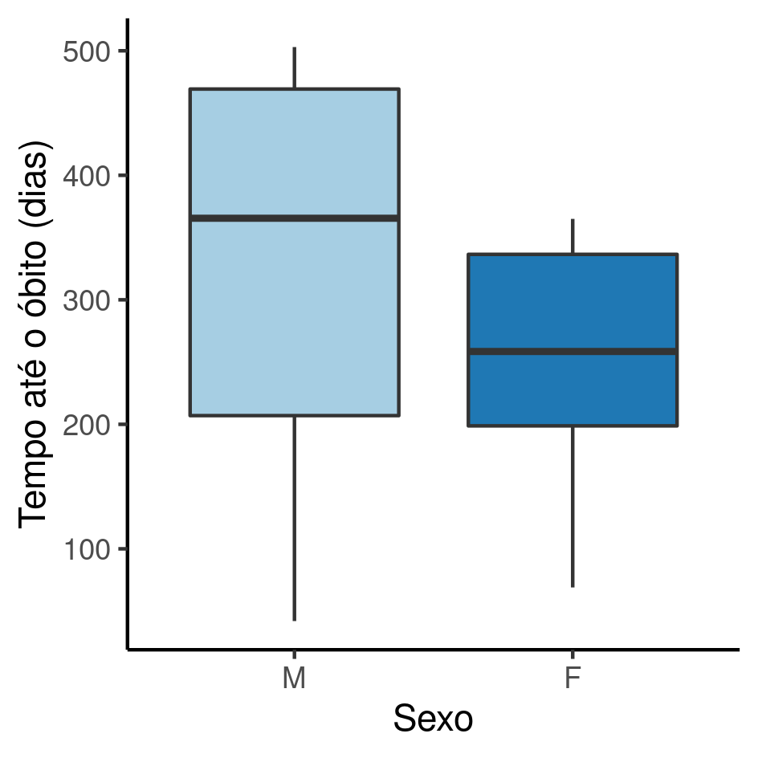

---

**Prognóstico de sobrevida em cativeiro de Tityus bahiensis capturados em Americana/SP**

**Histórico do documento**

|Versão |Alterações     |
|:------|:--------------|
|01     |Versão inicial |

---

# Lista de abreviaturas

- DP: Desvio padrão
- IC: Intervalo de confiança
- SMS: Secretaria Municipal de Saúde

# Contexto

## Objetivos

Determinar o tempo de sobrevida em cativeiro de espécimes capturados pelo programa de Vigilância Epidemiológica da SMS de Americana/SP.

## Recepção e tratamento dos dados

Dados recebidos com data de entrada e de óbito de espécimes de escorpião *Tityus bahiensis* capturados pelo programa de vigilância da secretaria Municipal de Saúde de Americana/SP.

Todos os espécimes foram mantidos em cativeiro até o óbito, portanto nenhuma observação foi censurada.
O tempo de sobrevida, em dias, foi calculado a partir das datas com acurácia de calendário isto é, levando em conta anos bissextos.

Duas fêmeas tiveram número de parições maior que zero registrado.
O número de parições de todos os outros espécimes foi definido como zero, de modo que esta contagem pudesse ser usada como covariável no prognóstico.

# Metodologia

## Variáveis

### Desfechos primário e secundário

O desfecho primário foi definido como o tempo, em dias, até o óbito.

### Covariáveis

O sexo e o número de parições foram usados como covariáveis na estimativa do tempo até o óbito.
O tempo até o óbito de metade da amostra (meia-vida na amostra) foi estimado separadamente para machos e fêmeas, e ajustado pelo número de parições das fêmeas.

## Análises Estatísticas

O perfil dos espécimes do estudo foi descrito na baseline.
O sexo e o número de parições foram descritas como
média (DP)
ou frequência e proporção (%), conforme apropriado.
As distribuições das características dos espécimes foram resumidas em tabelas e visualizadas em gráficos exploratórios.

A análise de sobrevida foi realizada com o modelo de regressão de sobrevida semi-paramétrico de Cox.
Este modelo é capaz de estimar o tempo até o óbito, ajustando o tempo pelo sexo e número de parições.

O modelo de Cox presume que os riscos de óbito entre machos e fêmeas são proporcionais.
Este requisito foi avaliado por inspeção visual das curvas de sobrevida -- como as curvas não se cruzam, o modelo de Cox foi usado conforme a especificação descrita no plano analítico e não houve necessidade de usar um modelo não paramétrico (estimação de Kaplan-Meier).

Os tempos de sobrevida (em dias) da meia-vida de machos e fêmeas foram extraídos do modelo final, e apresentados com seus respectivos intervalos de confiança.

Todas as análises foram realizadas ao nível de significância de 5%.
Todos os testes de hipóteses e intervalos de confiança calculados foram
bicaudais.

Esta análise foi realizada utilizando-se o software `R` versão 4.1.1.

# Resultados

## População do estudo e acompanhamento

Um total de 18 espécimes foram recebidos pelo programa de Vigilância Epidemiológica da SMS de Americana/SP entre 2015-10-13 e 2020-07-28 (Tabela 1).
Destes 6 (33%) eram machos e 12 (67%) fêmeas.
Duas fêmeas produziram prole no cativeiro, e uma delas o fez duas vezes.

Table: **Tabela 1** Caracerísticas dos espécimes de T. bahiensis recebidos pelo Programa de Vigilância Epidemiológica de Americana/SP.

|**Características**          | **Total**, N = 18 | **M**, N = 6 | **F**, N = 12 |
|:----------------------------|:-----------------:|:------------:|:-------------:|
|__Tempo até o óbito (dias)__ |     276 (129)     |  322 (185)   |   253 (92)    |
|__Número de parições__       |                   |              |               |
|0                            |     16 (89%)      |   6 (100%)   |   10 (83%)    |
|1                            |     1 (5.6%)      |    0 (0%)    |   1 (8.3%)    |
|2                            |     1 (5.6%)      |    0 (0%)    |   1 (8.3%)    |

Os tempos de sobrevida em cativeiro dos escorpiões recebidos variou entre 42 e 503 dias.
Os tempos de sobrevida dos espécimes machos variaram entre 42 e 503 dias e das fêmeas 69 e 365 dias.
O tempo de sobrevida mediano dos machos foi 365.5 e das fêmeas 258.5 dias (Figura 1).

**Figura 1** Distribuição dos tempos de sobrevida na população do estudo.

## Prognóstico dos espécimes em cativeiro

O tempo de meia-vida em cativeiro dos escorpiões recebidos foi 285 (IC: 203 até 365) dias.
O tempo de meia-vida dos machos foi 365 dias e das fêmeas 251 dias (Tabela 2).

Table: **Tabela 2** caption

|**Características**         | **Tempo de meia-vida (dias)** |
|:---------------------------|:-----------------------------:|
|__Sexo:Número de parições__ |                               |
|M                           |        365 (285, 477)         |
|F:0                         |        251 (181, 293)         |
|F:1                         |        293 (203, 365)         |

A figura 1 mostra as curvas de sobrevida de machos, fêmeas com 0 parições e fêmeas com uma parição.
De acordo com o modelo ajustado, fêmeas que tiveram uma parição podem ter um prognóstico mais favorável em cativeiro, com um acréscimo de sobrevida estimado em torno de 40 dias (293 dias, IC: [203, 365]).

**Figura 2** Sobrevida em cativeiro dos espécimes recebidos pelo Programa de Vigilância Epidemiológica de Americana/SP.

<!-- As fêmeas exibiram risco três vezes maior que os machos com HR 2.91 (95% CI 0.79, 10.7; p=0.11). -->
<!-- Corrigindo pelas parições observadas o risco é quatro vezes maior, com HR ajustada 3.94 (95% CI 0.95, 16.4; p=0.059). -->

# Observações e limitações

Embora o número de parições tenha contribuído para um melhor ajuste do tempo de sobrevida, a amostra de estudo era pequena e o termo de interação entre sexo e número de parições não foi incluído no modelo final.

# Conclusões

# Referências

- **SAP-2021-008-JB-v01** -- Plano Analítico para Prognóstico de sobrevida em cativeiro de Tityus bahiensis capturados em Americana/SP
<!-- - Cohen, J. (1988). Statistical power analysis for the behavioral sciences (2nd Ed.). New York: Routledge. -->

# Apêndice

<!-- ## Análise exploratória de dados -->

## Disponibilidade

Tanto este documento como o plano analítico correspondente (**SAP-2021-008-JB-v01**) podem ser obtidos no seguinte endereço:

<!-- Este documento pode ser obtido no seguinte endereço: -->

<https://philsf-biostat.github.io/SAR-2021-008-JB/>

## Dados utilizados

Os dados utilizados neste relatório não podem ser publicados online por questões de sigilo.

| id  | obito | tempo | sexo | paricoes |
|:---:|:-----:|:-----:|:----:|:--------:|
|  1  |       |       |      |          |
|  2  |       |       |      |          |
|  3  |       |       |      |          |
| ... |       |       |      |          |
| 18  |       |       |      |          |

Table: **Tabela A1** Estrutura da tabela de dados analíticos
